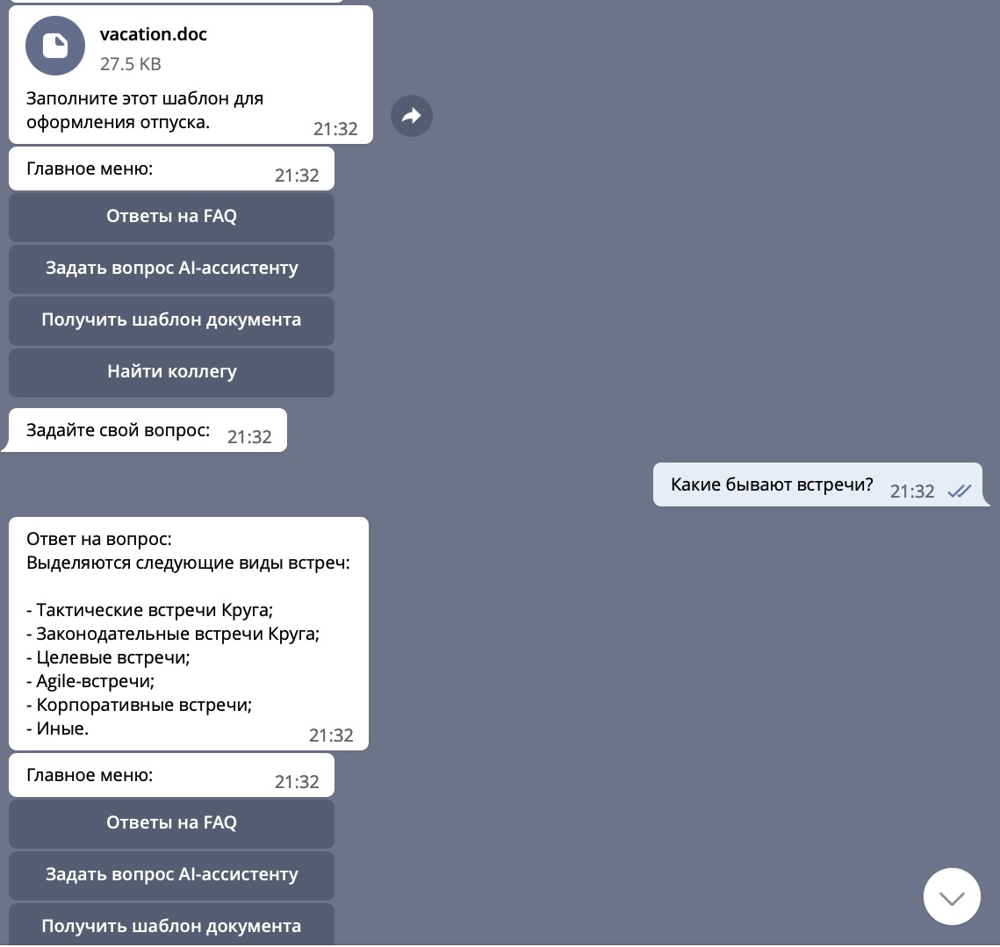

# HR-Bot Хьюстон

Привет! Меня зовут Хьюстон, и я ваш виртуальный HR-помощник, созданный, чтобы сделать ваш рабочий процесс немного проще и приятнее. Я здесь, чтобы помочь вам с различными HR-запросами и предоставить нужную информацию быстро и эффективно.

## Возможности

Вот что я могу сделать для вас:

- **Ответы на FAQ**: Помогу найти ответы на частые вопросы относительно отпуска, больничных, зарплат и прочих HR-тем.
  
- **Отвечать на вопросы**: Если у вас есть специфический вопрос, я постараюсь помочь. Просто задайте мне его, и я сделаю всё возможное, чтобы предоставить вам нужную информацию.
  
- **Поиск коллег**: Помогу найти контактные данные ваших коллег по их именам.
  
- **Забота**: Анализирую ваше ментальное здоровье, предлагаю опросы и рекомендации для поддержания ваших душевных сил.
  
- **Информирование о важных изменениях**: Буду держать вас в курсе последних новостей компании, важных обновлений и предстоящих событий.

## Как со мной взаимодействовать?

Для взаимодействия со мной просто отправьте сообщение в чат. Я всегда здесь, чтобы помочь!

## Обратная связь и поддержка

Если у вас есть предложения по улучшению моих функций или если вы столкнулись с проблемой, пожалуйста, обратитесь к команде разработки или отправьте свои отзывы через эту платформу.

